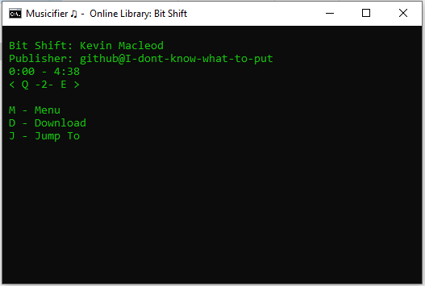
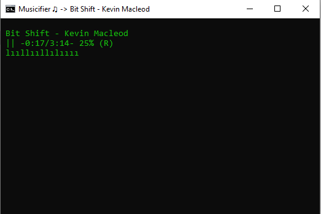

# Musicifier
## What it does:
Musicifier is a basic application that plays wav, mpm, and mp3 files using command prompt, vbscript and powershell.

It does not use any executable file therefore making it storage efficient, CPU efficient, and memory efficient.

It also supports online streaming using github.

## Screenshots:
Online Library:

Music Player:

## Download Musicifier:
| Version      | Batch Downloader | PS1 Downloader | Zip Downloader |
| :----------- | :--------------- | :------------- | :-------------------------------------------------------------------------------------------------------------------------- |
| v1.0.0       | None             | None           | [Download](https://raw.githubusercontent.com/I-dont-know-what-to-put/musicifier/refs/heads/main/versions/v1.0.0/v1.0.0.zip) |

### How to download (using zip):
Download the zip file. Then after downloading, extract all files in the zip file in an empty folder. Then press "App.bat" to start it.

### Windows said its unsafe:
If windows said that the program is unsafe it's a false positive, you can look through the code and find that it isn't harmful or anything.

- If "Windows protected your PC" showed up, press "More info" then "Run anyway" this program isn't a malware, Windows is just unsure that if its a malware since its unverified.

- If "Do you want to open this file?" showed up, uncheck "Always ask before opening this file" then open.

# Upload music to the online library:
Publishing music in the online library means your agreeing to the [Online Library Publishing Terms of Service](https://github.com/I-dont-know-what-to-put/musicifier/blob/main/onlinelibrary/PublishingTOS.md)

To publish a music into the online library you must fill the [Publishing Form](https://forms.gle/oFn7o2Pb2DHgXm2a6)

It may take days for your music to be available in the online library.
